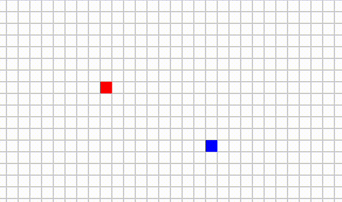
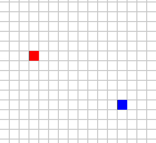
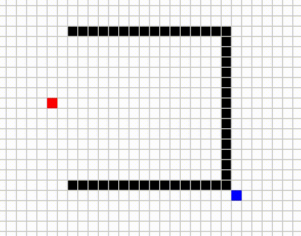
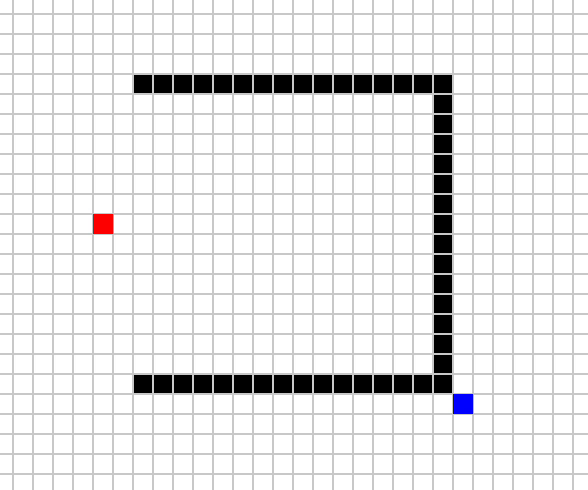

# Path Finding Simulation
We implemented the pathfinding algorithms in Python using Pygame to visually demonstrate how it finds the optimal path. The algorithm then calculates and displays the most optimal path from start to finish.

## Controls
* The first cell you click is marked in blue and indicates the starting point.
* The second cell you click is marked in red and indicates the destination.
* After deciding on a starting point and destination, a user clicks cells to build obstacles indicated by black. Click again to remove an obstacle. You can drag to build multiple obstacles.
* Press `1`, `2`, or `3` to choose A*, Dijkstra's, or Greedy Best-First Search pathfinding algorithm.
* Press `r` to clear everything
* Press `spacebar` to start pathfinding

## Colors
* Red: Starting point
* Blue: Destination
* Black: Obstacles
* Green: Optimal Path
* Yellow: Node being explored
* Cyan: Node being added to open list

## Pathfinding Comparison – Case 1

| Dijkstra’s Algorithm | Greedy Best-First Search | A* Algorithm |
|:--------------------:|:------------------------:|:------------:|
|   |       |  |

## Pathfinding Comparison – Case 2

| Dijkstra’s Algorithm | Greedy Best-First Search | A* Algorithm |
|:--------------------:|:------------------------:|:------------:|
|   |       |  |

# Reference
https://theory.stanford.edu/~amitp/GameProgramming/AStarComparison.html
